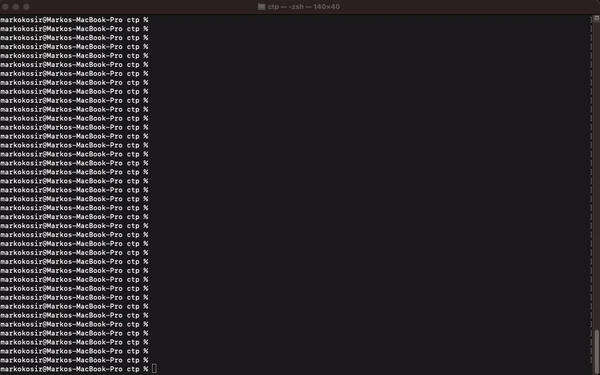

# Ocignis Bot

[![CI][ci-badge]][ci-url]
[![CI-Deployment][ci-deployment-badge]][ci-deployment-url]

Binance minimal trading bot with API to easily run, stop or schedule trading strategies.  
Build algorithms in Typescript with focus on best practices and painless developer experience.

## Features:

- Minimal setup that can be extended 🔧
- Spin it up with single command 🌀
- Can be easily modified to work with any exchange or trading asset (currently setup to Binance)
- Dockerized:
  - Instantly create multiple bot containers with different strategies parameters ⚡
  - Nodejs v18 Alpine multi-stage image build ~120 MB (created on every GitHub Release)
- End-To-End type safety with TypeScript (Database <-> Bot <-> API <-> Frontend) - Always execute your trading strategies safe ✅
- tRPC API for seamless [frontend app](https://github.com/ocignis/ocignis-fe) integration
- Optional Express.js REST API
- Websocket implementation. Get every single trade in real time.
- Implemented with Binance integration, but extendable for any crypto or stock exchange

## Requirements

- [Node v18+](https://nodejs.org/)
- [Docker](https://www.docker.com/)

## Running

_Easily set up a local development environment with single command!_

### Bot:

- clone the repo
- rename [file to _dev.env_](https://github.com/ocignis/ocignis-bot/blob/main/envs/dev.example.env) and set env vars(create [Binance API keys](https://www.binance.com/en/support/faq/how-to-create-api-keys-on-binance-360002502072))
- `npm run dev` 🚀

Visit:

- terminal:

- or [React App](https://github.com/ocignis/ocignis-fe):

  https://user-images.githubusercontent.com/3073826/225337569-9dc165e9-d5e8-4e36-95cd-23ad7facc34b.mp4

### Backtesting:

- download trades from Binance `npm run backtest-download-data`
- seed database `npm run backtest-seed-database`
- `npm run backtest-run` 🚀

## Stack:

- [TypeScript v5](https://github.com/microsoft/TypeScript) codebase with [Strict Configuration](https://typescript-eslint.io/docs/linting/configs#strict)
- [tRPC v10](https://trpc.io/) API for client integration.
- [Prisma v4](https://www.prisma.io/) ORM
- Unit and integration tests with [Jest](https://github.com/facebook/jest)
- Linting with [ESLint](https://eslint.org/)
- [Prettier](https://prettier.io/) code formatter
- Git hooks with [Husky](https://github.com/typicode/husky) and [lint-staged](https://github.com/okonet/lint-staged)
- Commit messages must meet [conventional commits](https://www.conventionalcommits.org/en/v1.0.0/) format.  
  After staging changes just run `npm run commit` and get instant feedback on your commit message formatting and be prompted for required fields by [Commitizen](https://github.com/commitizen/cz-cli)

## Commands

| Command                           | Description                                                                  |
| --------------------------------- | ---------------------------------------------------------------------------- |
| prepare                           | Setup git hooks with Husky (executes on npm install)                         |
| build-ocignis-shared              | Build and export tRPC types                                                  |
| dev                               | Start bot and database                                                       |
| dev-changed-deps                  | Build and start bot image                                                    |
| build                             | Build bot                                                                    |
| lint                              | Lint whole repository                                                        |
| lint-fix                          | Run lint fix                                                                 |
| lint-staged-husky                 | Run prettier and lint on staged files                                        |
| tsc                               | Run TypeScript compiler                                                      |
| test                              | Run tests                                                                    |
| test-watch                        | Run tests in watch mode                                                      |
| format-lint                       | Lint formatting with Prettier                                                |
| format-fix                        | Fix formatting with Prettier                                                 |
| commit                            | Run Commitizen on staged file                                                |
| clean                             | Remove installed, generated and cached folders (node_modules, coverage etc.) |
| update-binance-backtest-file-data | Download and update binance csv data files                                   |
| update-binance-backtest-database  | Update database for backtesting                                              |
| bot-backtest                      | Run backtest                                                                 |
| db-prisma-client-generate         | Generate Prisma client                                                       |
| db-migration-generate             | Generate migration                                                           |
| db-migration-run                  | Run migration helper                                                         |
| db-migration-run-dev              | Run migration localy on dev                                                  |
| db-migration-run-prod             | Run migration on production                                                  |
| docker-dev                        | Start bot localy on dev                                                      |
| docker-prod                       | Start bot in production                                                      |
| docker-compose-run                | Start bot and database in docker containers                                  |
| docker-compose-run-changed-deps   | Build bot image and start                                                    |

<!-- Badges -->

[ci-badge]: https://github.com/ocignis/ocignis-bot/actions/workflows/CI.yml/badge.svg
[ci-url]: https://github.com/ocignis/ocignis-bot/actions/workflows/CI.yml
[ci-deployment-badge]: https://github.com/ocignis/ocignis-bot/actions/workflows/CI-Deployment.yml/badge.svg
[ci-deployment-url]: https://github.com/ocignis/ocignis-bot/actions/workflows/CI-Deployment.yml
